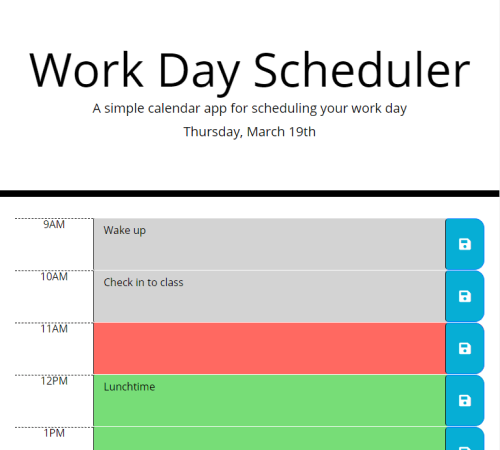

# Work Day Scheduler

A responsive scheduling applet that allows the user to enter and save todo items for each hour of the work day.

## Usage

### [Try it!](https://mgrinx.github.io/work-day-scheduler)
Select a time block to edit the text it contains. When you want to save an entry, click the save button.

## Features

- Formatted date displayed in header
- Current time tracked by color (gray = past, red = present, green = future)
- Buttons save each entry in local storage
- Saved data persists through page reload